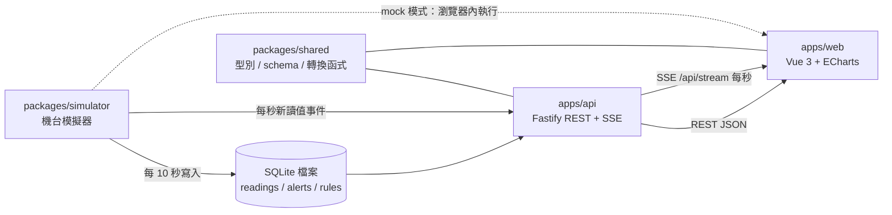
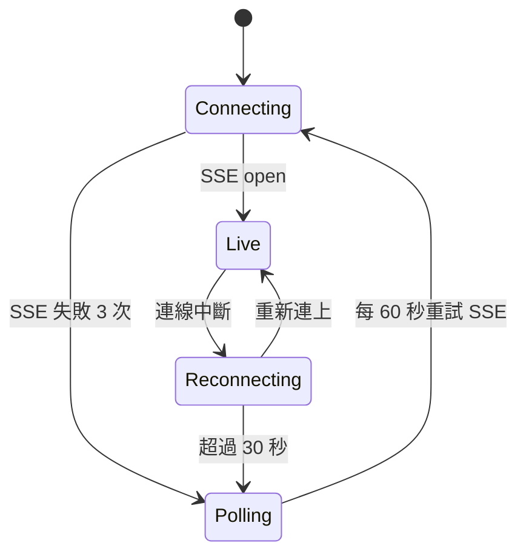

# PRD：機台戰情室 AIoT Monitor（aiot-monitor）

## 背景與目標

目標職缺類型：製造業智慧化（工業 4.0、AIoT、智慧工廠）領域的前端 / 全端工程師。

- **領域業務**：機台聯網與資料蒐集、資料儲存、數據視覺化與監控、資料分析與預測（例如預測性維護）。
- **常見工作內容**：開發與優化前端介面、配合使用者需求測試、與 PM 及後端合作開發 Web 與伺服器端 API。
- **常見技能要求**：JavaScript、jQuery、Node.js；加分項常見 Vue.js 或 React.js、TypeScript、企業 UI 套件（如 Kendo UI）、C# 後端、IIS 部署。
- **常見面試考點**：
  1. 筆試：JS array 方法與小範例、所用框架優缺點、**串接 API 並把資料呈現成表格與折線圖**。
  2. 看作品集時追問「**作品集的資料存在哪裡**」；只回答 localStorage 說服力不足。
  3. 實務上常把資料輸出成折線圖、圓餅圖。
  4. 作品集要能隨時打開，被問到能立刻介紹。

**這個專案要證明的事**：我能用 Vue 3 + TypeScript + Node.js 做出一套「模擬工廠機台 → 後端收集儲存 → API → 即時與歷史視覺化」的完整 AIoT 監控系統，每一項考點都對應到可以現場打開的畫面與程式碼。

**定位**：作品集重點是「證明會這些技能」，不是處理大量資料。資料量刻意保持小（DB 約 7 萬筆以內），本機啟動在 1 秒內完成回填，demo 與測試都快。

## 考點對照

| 考點 | 專案中的對應 | 現場展示 |
|------|--------------|----------|
| JS array 方法 | `packages/shared` 的資料轉換全部以 `map` / `filter` / `reduce` / `Object.groupBy` / `toSorted` / `flatMap` / `findLast` 實作，並有單元測試；「陣列方法實驗室」頁面用真實機台資料逐一示範 | `/lab/array` |
| 框架優缺點 | `docs/interview/framework-tradeoffs.md`：Vue 3 / React / jQuery + Kendo UI 的比較與本專案選型理由 | 口頭 + 文件 |
| API → 表格 + 折線圖 | 歷史查詢頁：篩選條件打 REST API，結果同時呈現為可排序分頁表格與折線圖，兩者連動 | `/history` |
| 資料存在哪裡 | Node.js API + SQLite 檔案（`apps/api/data/aiot.db`；WAL、`(machine_id, ts)` 索引、24 小時保留期、伺服器端分桶降採樣）；告警規則與確認紀錄也寫入資料庫；前端只做記憶體快取，localStorage 僅存 UI 偏好 | `/about` 架構圖 + 程式碼 |
| 折線圖、圓餅圖 | 即時多指標折線圖、機台狀態圓餅圖、OEE 儀表、班別產量長條圖（ECharts） | `/`、`/machines/:id` |
| 作品集隨時可開 | 無後端時自動切換為瀏覽器內模擬資料（mock 模式）；部署位置暫緩，見「暫緩項目」 | 本機 / 日後線上網址 |
| 加分：TypeScript、Node.js | 前後端與共用套件全 TypeScript，Node 22 + Fastify | — |
| 加分：IIS | （暫緩）`deploy/iis/web.config`：SPA rewrite 與反向代理到 Node API 的設定與說明 | 文件 |
| 加分：Kendo UI | Could：同一份資料以 Kendo UI for Vue Grid 做對照頁（實作前確認授權） | `/lab/kendo` |

## 範圍

- **Must**
  - 機台模擬器：8 台機台（CNC、成型機、研磨機），每秒產生溫度、振動 RMS、主軸負載、轉速、產量、良品數；可注入異常（漸進升溫、振動突波、停機）。亂數可設定 seed，測試結果可重現。
  - 資料保存（見「資料量與保存」）：即時讀值每 10 秒寫入 DB 一筆；API 啟動時回填過去 24 小時、每分鐘一筆；保留 24 小時。
  - 後端 API：Node 22 + Fastify + `node:sqlite`，提供機台清單、讀值查詢（分頁、排序、時間範圍）、時間序列分桶降採樣、總覽統計、SSE 即時串流、CSV 匯出。所有輸入以 zod 驗證。
  - 總覽頁：KPI 卡片（運轉率、OEE、今日產量、未處理告警）、機台狀態圓餅圖、機台卡片列表（即時更新）。
  - 機台詳情頁：即時多指標折線圖（1h / 6h / 24h、dataZoom、閾值線）、事件列表。
  - 歷史查詢頁：機台、指標、時間範圍篩選；伺服器端分頁排序表格 + 折線圖連動；CSV 匯出。
  - 資料狀態：每個資料區塊都有 loading、空資料、錯誤與重試畫面；請求有競態處理（AbortController）。
  - 共用套件：型別、zod schema、指標定義、OEE 計算與資料轉換函式，前後端共用。
  - 測試：shared / simulator / api 單元測試，web 元件測試，Playwright E2E 走過三個主要頁面；CI 全綠。
- **Should**
  - 告警中心：閾值規則 CRUD（寫入資料庫）、告警確認（ack）、SSE 推播新告警。
  - 趨勢預測：以最近 N 點線性迴歸估算「預計多久達到閾值」，模擬預測性維護。
  - 陣列方法實驗室頁面。
  - 架構說明頁（含資料流與儲存設計圖）。
  - 深色主題、RWD（最小 400px）、鍵盤操作與圖表的表格替代內容。
- **Could**
  - 圖表效能展示：LTTB 前端降採樣、Web Worker、頁面顯示「原始點數 / 繪製點數 / 耗時」。資料量小，僅作技能示範。
  - Kendo UI for Vue Grid 對照頁。
  - OpenAPI 文件（`@fastify/swagger`）。
  - 多語系（中 / 英）。
- **暫緩**（部署位置決定後再處理）
  - 前端部署（GitHub Pages 或 kentfolio.dev）與 API 雲端主機。
  - IIS 部署設定與文件。
- **Won't**
  - 大量資料（數百萬筆）與長期保存；文件說明正式環境改用時間序列資料庫的做法。
  - 使用者登入與權限（以單一示範帳號假設，PRD 說明正式環境做法）。
  - C# 後端實作（只在 framework-tradeoffs 文件中說明若改用 ASP.NET Core 的差異）。
  - 真實硬體 / MQTT broker 接入（模擬器介面預留 adapter，文件說明換成 MQTT 的方式）。

## 使用情境

- 身為**廠長**，我想要打開總覽頁就看到所有機台狀態與 OEE，以便知道今天產線是否正常。
- 身為**設備工程師**，我想要在機台詳情頁看到振動與溫度的即時曲線和趨勢預測，以便在故障前安排保養。
- 身為**品管人員**，我想要查詢指定時間範圍的讀值並匯出 CSV，以便做離線分析。
- 身為**面試官**，我想要看到資料從哪裡來、存在哪裡、怎麼變成圖表，以便評估候選人的全端理解。

## 系統架構



### 目錄

```
aiot-monitor/
  apps/
    web/          Vue 3 + TS + Vite + Pinia + Vue Router + vue-echarts
    api/          Node 22 + Fastify + node:sqlite + zod
      data/       aiot.db（SQLite 檔案，不進 git）
  packages/
    shared/       型別、zod schema、指標定義、OEE、資料轉換（純函式）
    simulator/    可設定 seed 的機台資料產生器（Node 與瀏覽器共用）
  deploy/iis/     （暫緩）web.config 與說明
  docs/           PRD、TODO、面試文件
  e2e/            Playwright
```

### 技術選型

| 項目 | 選擇 | 理由 |
|------|------|------|
| 前端框架 | Vue 3 `<script setup>` + TS | 此領域職缺常見；與既有作品一致，可專注在資料視覺化 |
| 圖表 | Apache ECharts + vue-echarts（按需引入） | 工業儀表板常用；折線、圓餅、儀表、長條、dataZoom、閾值線（`markLine`）全部內建；按需引入控制體積 |
| 表格 | 自製 `DataTable`（伺服器端分頁排序） | 展示 array 與型別設計能力；Kendo Grid 另做對照 |
| 狀態 | Pinia（跨頁的機台清單與即時讀值）+ composable（頁面查詢） | 依 vue-conventions |
| 後端 | Fastify | 內建 schema 驗證、效能好、`inject()` 方便測試 |
| 資料庫 | `node:sqlite`（Node 22 內建） | 零原生相依、單檔、可回答「資料存在哪」 |
| 即時 | SSE | 單向推播足夠、瀏覽器自動重連、可穿過 IIS / 反向代理；文件說明何時改用 WebSocket |
| 驗證 | zod（shared） | 前後端共用同一份 schema，API 回應在前端也驗證 |
| 測試 | Vitest、@vue/test-utils、Playwright | 與既有專案一致 |

圖表套件比較（面試用）：Chart.js 較輕但無內建儀表、縮放需外掛；ApexCharts 上手快但客製化較弱；Highcharts 功能完整但商用需授權。

## 資料量與保存

| 項目 | 設定 | 說明 |
|------|------|------|
| 機台數 | 8 台 | 固定設定檔，啟動時 seed 到 `machines` |
| 即時產生頻率 | 每秒 1 筆 / 台 | 由 SSE 推播給前端，即時圖表每秒更新 |
| 寫入 DB 頻率 | 每 10 秒 1 筆 / 台 | 取該 10 秒的最後一筆；產量、良品數為累計值不受影響 |
| 啟動回填 | 過去 24 小時、每分鐘 1 筆 / 台 | `readings` 為空或最新一筆早於 24 小時前才回填；固定 seed、單一 transaction，約 1.2 萬筆 |
| 保留期 | 24 小時 | 每 10 分鐘刪除 24 小時前的資料 |
| 資料量上限 | 約 7 萬筆 | 8 台 × 8640 筆 / 天 |
| 存放位置 | `apps/api/data/aiot.db` | `.gitignore` 已排除；刪除檔案後重啟即重新回填 |
| mock 模式 | 瀏覽器記憶體 | 由 simulator 在瀏覽器內產生，關閉分頁即消失，不寫 localStorage |

## 資料與介面

### 資料表

| 表 | 欄位 | 備註 |
|----|------|------|
| `machines` | `id`, `name`, `type`, `line`, `ideal_cycle_sec` | 啟動時 seed |
| `readings` | `machine_id`, `ts`(ms), `temperature`, `vibration`, `spindle_load`, `rpm`, `status`, `output`, `good` | 索引 `(machine_id, ts)`；保留 24 小時 |
| `alert_rules` | `id`, `machine_id?`, `metric`, `op`, `threshold`, `duration_sec`, `enabled` | 告警規則 |
| `alerts` | `id`, `rule_id`, `machine_id`, `ts`, `value`, `acked_at?` | 告警紀錄 |

### API

| 方法 | 路徑 | 說明 |
|------|------|------|
| GET | `/api/health` | 健康檢查 |
| GET | `/api/machines` | 機台清單與最新狀態 |
| GET | `/api/machines/:id/series?metric&from&to&points` | 時間序列，伺服器端依 `points` 分桶回傳 avg / min / max |
| GET | `/api/readings?machineId&from&to&page&pageSize&sort` | 原始讀值分頁查詢 |
| GET | `/api/readings.csv?machineId&from&to` | CSV 串流匯出 |
| GET | `/api/stats/overview` | 運轉率、OEE、產量、狀態分布 |
| GET | `/api/stream` | SSE：`reading`、`alert` 事件 |
| GET / POST / PATCH / DELETE | `/api/alert-rules` | 告警規則 CRUD |
| GET / PATCH | `/api/alerts`、`/api/alerts/:id/ack` | 告警列表與確認 |

錯誤格式統一為 `{ error: { code, message } }`；查詢範圍上限 24 小時、`pageSize` 上限 500。

### 前端資料來源

`apps/web/src/api/` 定義 `ApiClient` 介面，兩種實作：

- `httpClient`：打真實 API，回應經 zod 驗證。
- `mockClient`：在瀏覽器內以 simulator 產生資料（記憶體保存），介面相同。

`VITE_API_MODE=http | mock`；`http` 模式下 `/api/health` 失敗時頁面提示並可一鍵切換 mock。

## 狀態與流程



畫面右上角顯示連線狀態（即時 / 重連中 / 輪詢 / 模擬資料）。

## 邊界情況

| 編號 | 情境 | 預期行為 |
|------|------|----------|
| EC-01 | 歷史查詢快速切換條件 | 前一個請求被 abort，只顯示最後一次結果 |
| EC-02 | 查詢範圍無資料 | 表格與圖表顯示空狀態與「調整時間範圍」提示，不顯示空白座標軸 |
| EC-03 | API 500 或逾時（10 秒） | 區塊顯示錯誤訊息與重試按鈕，其他區塊不受影響 |
| EC-04 | 查詢 24 小時資料 | 圖表走伺服器端分桶降採樣端點，繪製點數不超過 2000；表格走分頁 |
| EC-05 | SSE 斷線 | 依狀態圖重連；重連後補抓斷線期間的資料，不重複、不遺漏 |
| EC-06 | 分頁在背景 | 暫停圖表重繪，回到前景時一次更新 |
| EC-07 | 感測值缺漏（null） | 折線圖斷線而非連到 0；表格顯示「—」 |
| EC-08 | 時間範圍 from > to 或超過 24 小時 | 前端表單阻擋並提示；API 回 400 |
| EC-09 | 視窗縮放、側欄收合 | 圖表以 ResizeObserver 重新計算尺寸 |
| EC-10 | 離開頁面 | ECharts instance dispose、SSE 訂閱與 timer 清除 |

## 非功能需求

- **效能**：首頁 JS gzip ≤ 250KB（ECharts 按需引入；目前實測約 293KB，見 `PRD-chart-perf.md`）；即時圖表每秒更新時維持 60fps；`/series` 24 小時查詢 p95 < 300ms（本機）；API 啟動含回填 < 3 秒。
- **無障礙**：所有圖表附「以表格檢視」切換；色彩不作為唯一狀態辨識（加圖示與文字）；鍵盤可操作篩選與分頁。
- **RWD**：最小 400px；手機版 KPI 卡片兩欄、圖表全寬。
- **時間**：一律以 UTC ms 儲存，畫面以 `Intl.DateTimeFormat`（Asia/Taipei）顯示。
- **可維護**：前端無 `any`；API 回應全經 schema 驗證；lint、typecheck、test 在 CI 執行；後端程式保持簡單，路由、資料存取、模擬器分檔。

## 協作方式

開發者以前端為主，後端由 Claude 實作。為了讓開發者能在面試時說明後端：

- 每完成一個後端項目（storage、rest-api、sse-stream、alerts），以白話說明資料如何寫入、查詢與推播，並回答開發者的問題。
- 用 `/interview-notes` 為上述項目產生講稿，含面試官可能追問的問題與回答。
- 面試主講前端（圖表、表格、資料狀態），後端講到能清楚說明資料流為止。

## 驗收標準

- [x] AC-01：Given API 啟動，When 開啟總覽頁，Then 3 秒內看到 8 台機台、KPI 與狀態圓餅圖，且每秒更新。
- [x] AC-02：Given 機台詳情頁，When 切換 1h / 6h / 24h，Then 折線圖繪製點數 ≤ 2000，並顯示閾值線。
- [x] AC-03：Given 歷史查詢頁，When 選擇機台與時間範圍送出，Then 表格與折線圖顯示同一批資料，表格可排序與分頁。
- [x] AC-04：Given 歷史查詢結果，When 點擊匯出，Then 下載的 CSV 筆數與表格總筆數一致。
- [x] AC-05：Given 本機重啟 API，When 重新整理頁面，Then 歷史資料、告警規則與確認紀錄仍存在（資料不在 localStorage）。
- [x] AC-06：Given `VITE_API_MODE=http` 且 API 未啟動，When 開啟網站，Then 提示並可切換 mock 模式，標示「模擬資料」。（線上自動 fallback 待部署時驗收）
- [ ] AC-07：邊界情況 EC-01 ~ EC-10 都有對應測試或手動驗證紀錄。（EC-06、EC-09 已實作但尚未驗證，見下表）
- [x] AC-08：`npm run lint`、`npm run typecheck`、`npm test`、`npm run test:e2e` 在 CI 全部通過。（GitHub Actions run 37408735968，1 分 21 秒）
- [ ] AC-09：`docs/interview/` 內的講稿能在 3 分鐘內完成 demo，涵蓋考點對照表的每一列。（TODO 第四階段）
- [x] AC-10：Given 刪除 `apps/api/data/aiot.db`，When 啟動 API，Then 3 秒內完成 24 小時回填，DB 筆數約 1.2 萬。

### 邊界情況驗證紀錄

| 編號 | 驗證方式 |
|------|----------|
| EC-01 | `useQuery.test.ts`：較舊請求晚回來時被忽略、前一個請求被 abort |
| EC-02 | API / mock 空範圍測試；`DataTable.test.ts` 空狀態；ChartPanel 空狀態不畫座標軸 |
| EC-03 | `http.test.ts` 逾時與 4xx / 5xx；瀏覽器實測 API 回 502 時各區塊各自顯示錯誤與重試 |
| EC-04 | `routes.test.ts` 點數 ≤ points；E2E 24 小時範圍繪製點數 ≤ 2000 |
| EC-05 | `live-connection.test.ts` 重連帶 lastEventId；`stream.test.ts` Last-Event-ID 補送與 resync |
| EC-06 | 已實作（`requestAnimationFrame` 合併、`document.hidden` 時不排程），尚未驗證 |
| EC-07 | `options.test.ts` null 保留且 `connectNulls: false`；`history.test.ts` 表格顯示「—」 |
| EC-08 | shared schema 測試；E2E 超過 24 小時被表單阻擋 |
| EC-09 | 已實作（vue-echarts `autoresize`），尚未驗證 |
| EC-10 | `live-connection.test.ts` stop 清除計時器；`useQuery.test.ts` scope 結束時 abort；ECharts 由 vue-echarts 在卸載時 dispose |

## 風險與待決策

| 項目 | 選項 | 建議 |
|------|------|------|
| 部署位置 | GitHub Pages / kentfolio.dev；API 用 Render / Fly.io / 自有主機 | 暫緩。決定前以本機 demo 與 mock 模式為主 |
| `node:sqlite` 仍為 experimental | 改用 `better-sqlite3` | 先用內建；repository 層隔離，必要時替換 |
| Vitest 解析 `node:sqlite` | 部分 Vite 版本可能無法解析此模組 | TODO 02 先寫 spike 測試確認；不行則調整 Vitest 設定或改 `better-sqlite3` |
| Kendo UI 授權 | 免費元件 / 試用版 / 不做 | 實作前確認 Kendo UI for Vue 免費元件範圍，不符合就只寫文件比較 |

## 變更紀錄

- 2026-10-06：第一至三階段實作完成（Kendo 對照頁除外）；API 預設 port 改為 3100（3000 常被其他工具占用）。
- 2026-10-06：資料量縮小（保留 7 天改 24 小時、回填改每分鐘一筆、DB 每 10 秒寫入、時間範圍改 1h / 6h / 24h）；大量資料效能降為 Could；部署與 IIS 暫緩；新增「資料量與保存」與「協作方式」。
