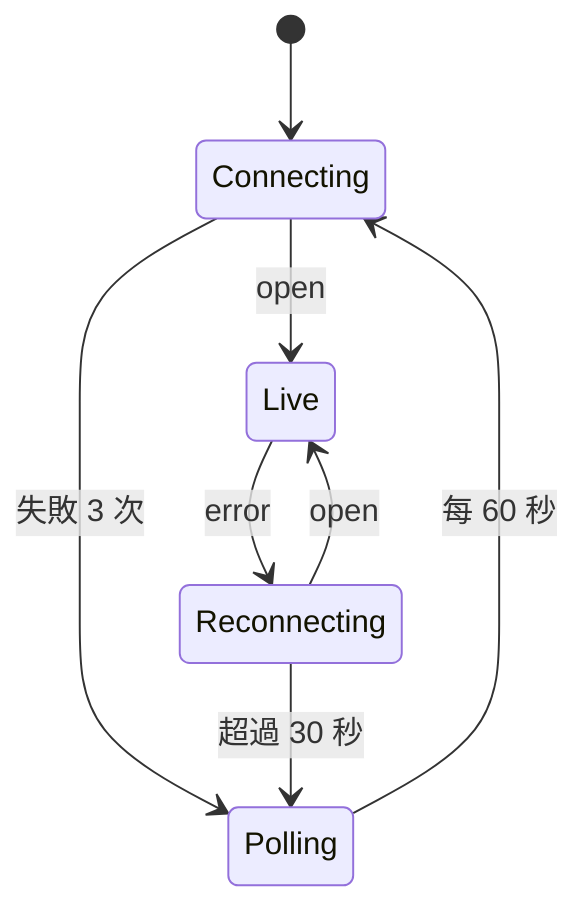

# PRD：SSE 即時串流（sse-stream）

## 目標

讓總覽與詳情頁每秒更新，並處理斷線：自動重連、補資料、退回輪詢。

## 範圍

- **Must**：
  - 後端 `GET /api/stream`：
    - 事件 `reading`（每秒一次，`id` 為 tick 的 ts，資料為 8 台的最新讀值）、`alert`（新告警）、`resync`（缺口超過補資料緩衝）。
    - 開頭送 `retry: 2000`；每 15 秒送 `: ping` 心跳；`X-Accel-Buffering: no`。
    - `Last-Event-ID` 標頭或 `?lastEventId=`：從記憶體緩衝（最近 300 秒）補送缺漏的 tick。
  - 前端 `useLiveStream`（全站一條連線）與 `live` store：
    - 狀態機：`connecting`、`live`、`reconnecting`、`polling`；mock 模式顯示「模擬資料」。
    - `connecting` 連續失敗 3 次轉 `polling`；`reconnecting` 超過 30 秒轉 `polling`；`polling` 每 5 秒打 `/api/machines`，每 60 秒重試 SSE。
    - 重新建立連線時帶 `lastEventId`；依 ts 去重，不重複、不遺漏。
    - 收到 `resync`：重新取 `/api/machines`，並通知頁面重新載入圖表。
    - 每台機台保留最近 3600 點（1 小時）的環形緩衝。
    - 分頁在背景時暫停通知圖表重繪，回到前景一次更新（EC-06）。
- **Won't**：WebSocket、雙向指令。

## 狀態與流程

## 邊界情況

| 編號 | 情境 | 預期行為 |
|------|------|----------|
| EC-01 | 斷線 5 秒後重連 | 補送 5 筆 tick，緩衝內 ts 不重複 |
| EC-02 | 斷線超過 300 秒 | 收到 `resync`，重新載入 |
| EC-03 | 離開頁面 / 關閉 app | EventSource close、timer 清除 |
| EC-04 | 同一 ts 收到兩次 | 第二次忽略 |

## 驗收標準

- [x] AC-01：後端 SSE 路由測試涵蓋 reading、alert、Last-Event-ID 補送與 resync。
- [x] AC-02：前端狀態機以假 EventSource + fake timers 測試每一條轉換。
- [x] AC-03：畫面右上角顯示連線狀態（即時 / 重連中 / 輪詢 / 模擬資料）。

## 開發紀錄

- 2026-10-06：完成。DB 每 10 秒才寫一筆，所以補資料靠記憶體中的 300 秒緩衝，而不是查 DB。
